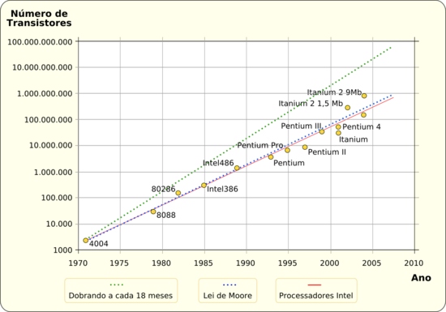
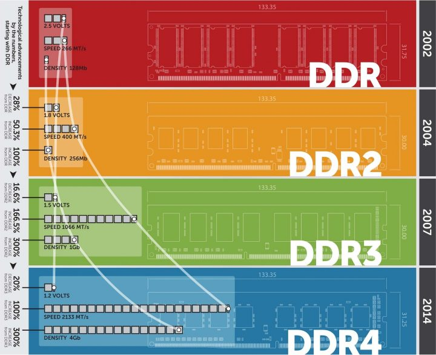

# Atividades Aula 2

## Atividade 1

### Supercomputadores no Brasil

| Quais os computadores no Brasil? (6) | Local Onde está instalado | Número de cores | Velocidade RMAX | Velocidade de pico |
| --- | --- | --- | --- | --- |
| Pégaso  | Petrobras - Rio de Janeiro - RJ | 233.856 | 019.070.000 | 041.995.700 |
| Dragão  | Petrobras - Rio de Janeiro - RJ | 188.224 | 008.983.000 | 014.006.480 |
| Atlas   | Petrobras - Rio de Janeiro - RJ | 091.936 | 004.376.000 | 008.848.486 |
| Fênix   | Petrobras - Rio de Janeiro - RJ | 060.480 | 003.161.000 | 005.371.776 |
| Grifo04 | Petrobras - Rio de Janeiro - RJ | 017.408 | 000.251.500 | 000.563.364 |
| Grifo06 | Petrobras - Rio de Janeiro - RJ | 010.368 | 000.160.300 | 000.357.466 |

### O que é benchmark linpack?

É uma medida do poder de computação de ponto flutuante de um sistema.

### O que é a medida FLOP?

É a unidade de medida que calcula a capacidade de desempenho de um supercomputador (Floating-point Operations Per Second)

### Qual a diferença de TFlop e PFLOF?

* 1 TeraFLOP/s equivale a 1 trilhão de operações de ponto flutuante por segundo
* 1 PetaFLOP/s equivale a quatrilhão de operações de ponto flutuante por segundo (ou mil TeraFlops)

## Atividade 2 - Gráficos para comparação entre evolução de CPUs X RAM

A evolução de CPU em relação à performance tende a ser maior em relação à evolução de performance da Memória RAM, a qual é causada em sua grande parte pelos componentes que são utilizados para fabricação das peças, tendo um desenvolvimento mais rápdio os componentes da CPU pois estes são mais simples em relação à sua arquitetura quando comparados com os componentes da arquitetura da Memória RAM.

### Gráfico CPU

### Gráfico RAM

## Atividade 3 - Classifique entre Arquitetura (AC) e Organização (OC)

* [OC] - Ciência que explica o que o computador deve fazer
* [AC] - Ciência que explica como o computador funciona
* [OC] - Relacionamento estrutural entre os componentes do computador
* [AC] - Comportamento funcional do sistema do computador
* [OC] - Relacionado com estruturas de alto-nível
* [AC] - Relacionado com estruturas de baixo-nível
* [AC] - Projetada primeira
* [OC] - Projetada após a finalização da outra

## Atividade 4 - Qual a diferença entre um processador 32bits e 64bits?

Um processador de 32bits possui a capacidade de processamento de $2^{32}$, aproximadamente , já o processador de 64bits possui uma capacidade de processamento de $2^{64}$. uma arquitetura de 64bits não possui o dobro de capacidade de uma arquitetura 32bits, mas 

## Atividade 5 - Na linha de comando extraia as informações a respeito das Memórias cache do computador

As mémórias cache possuem uma perda significativa de tamanho (capacidade total de alocação) em relação à tecnologia utilizada, quanto mais performance a memória cache tem em comparação às outras menor é seu tamanho (capacidade total de alocação). Isso se deve à complexidade de construção deste componente dentre outras, como por exemplo o preço de construção.

Comando Linux: `lscpu`

| Cache | tamanho |
| --- | --- |
| L1d | 128 KiB (4 instâncias) |
| L1i | 128 KiB (4 instâncias) |
| L2  | 1 MiB (4 instâncias)   |
| L3  | 6 MiB (1 instância)    |
